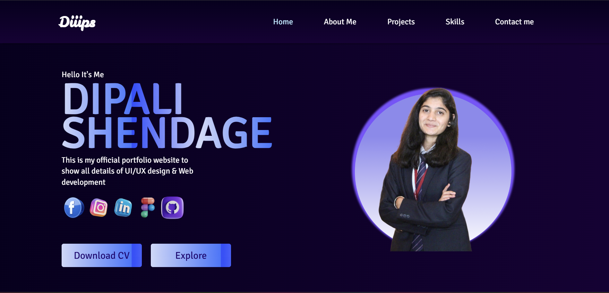
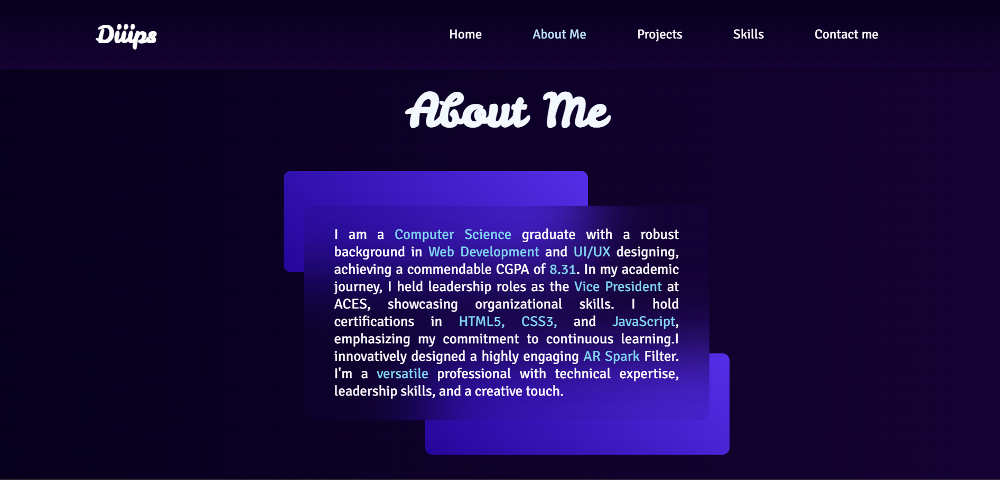
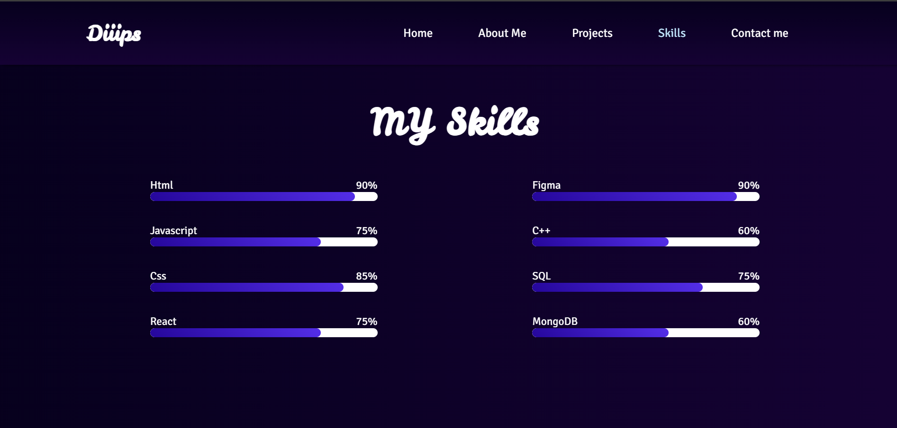
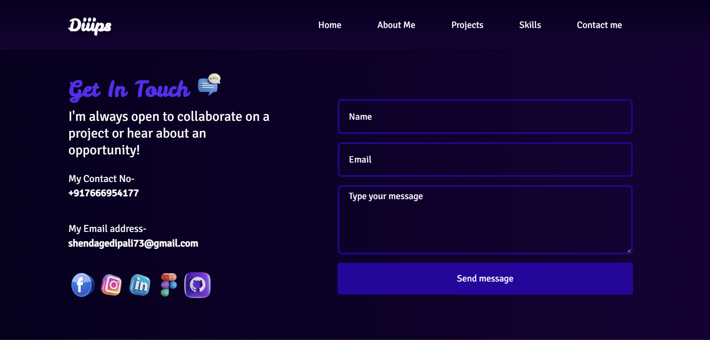

# 🌟 Personal Portfolio Website - **Dipali Shendage**

Welcome to my official portfolio website! This project showcases my skills, projects, and creativity as a **Web Developer** and **UI/UX Designer**. Built with **React**, this portfolio highlights my technical expertise and serves as a platform to connect and collaborate on exciting opportunities.

---

## 🔗 Live Demo  
[[Click here to explore the website](https://diiips.vercel.app/)] 

---

## 📜 About the Project  
This portfolio project is designed to provide a glimpse into my professional journey as a **Computer Science graduate** with strong experience in **Web Development** and **UI/UX Designing**.  

The website features:  
- A dynamic and responsive design.  
- Clean and organized sections, including **Home**, **About Me**, **Skills**, **Projects**, and **Contact Me**.  
- Integrated contact form to enable collaboration opportunities.  
- User-friendly interface with interactive and visually appealing components.

---

## 🚀 Technologies Used  
This portfolio is powered by modern web development tools and frameworks:  

- **React** - For building reusable and dynamic components.  
- **CSS3** - For sleek, responsive, and visually appealing design.  
- **HTML5** - For semantic and structured web pages.  
- **Figma** - Used for prototyping the UI/UX design.  
- **JavaScript** - For interactive functionalities.  

---

## ✨ Features  
- **About Me**: Showcases my education, skills, certifications, and achievements. Includes an Explore Button linking to my Linktree for more insights.
- **Skills**: Graphical display of my expertise in HTML, CSS, React, Figma, MongoDB, and more.
- **Projects**: A curated list of my best work with links to live demos and repositories.
- **Contact**: Easy-to-use form plus links to email, phone, and social media for direct connection.
- **Download CV**: Instantly access my resume with a single click 

---

## 🚀 Portfolio Preview 
 

 

 

  

  

---
😊
