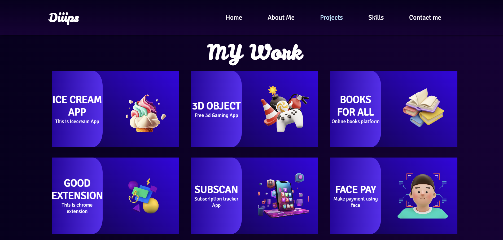

# 🌟 Personal Portfolio Website - **Dipali Shendage**

Welcome to my official portfolio website! This project showcases my skills, projects, and creativity as a **Web Developer** and **UI/UX Designer**. Built with **React**, this portfolio highlights my technical expertise and serves as a platform to connect and collaborate on exciting opportunities.

---

## 🔗 Live Demo  
[[Click here to explore the website](https://diiips.vercel.app/)](#) *()*

---

## 📜 About the Project  
This portfolio project is designed to provide a glimpse into my professional journey as a **Computer Science graduate** with strong experience in **Web Development** and **UI/UX Designing**.  

The website features:  
- A dynamic and responsive design.  
- Clean and organized sections, including **Home**, **About Me**, **Skills**, **Projects**, and **Contact Me**.  
- Integrated contact form to enable collaboration opportunities.  
- User-friendly interface with interactive and visually appealing components.

---

## 🚀 Technologies Used  
This portfolio is powered by modern web development tools and frameworks:  

- **React** - For building reusable and dynamic components.  
- **CSS3** - For sleek, responsive, and visually appealing design.  
- **HTML5** - For semantic and structured web pages.  
- **Figma** - Used for prototyping the UI/UX design.  
- **JavaScript** - For interactive functionalities.  

---

## ✨ Features  
- **About Me**: Highlights my education, technical skills, certifications, and achievements.  
- **Skills Section**: A graphical representation of my proficiency in HTML, CSS, JavaScript, React, Figma, SQL, MongoDB, and more.  
- **Contact Section**: Allows users to reach me via a contact form, email, or social media links.  
- **Download CV**: Direct option to download my resume.  

---

## 🚀 Portfolio Preview 

### Home Page  

### About Me  

### Projects  

### Skills  

### Contact me  

---
😊
